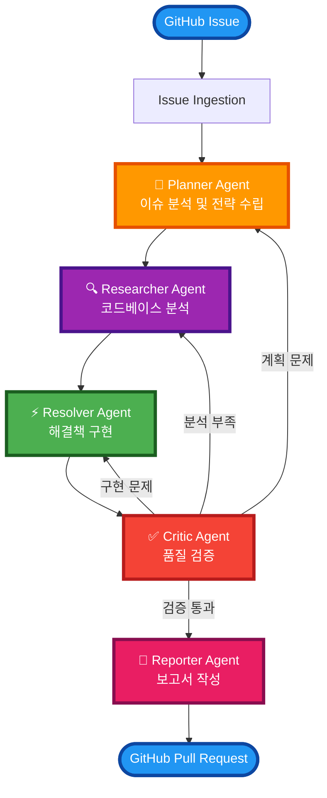
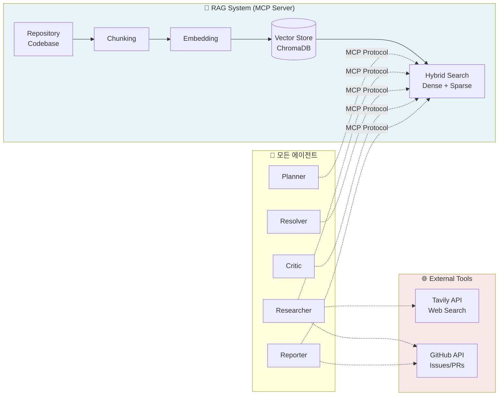
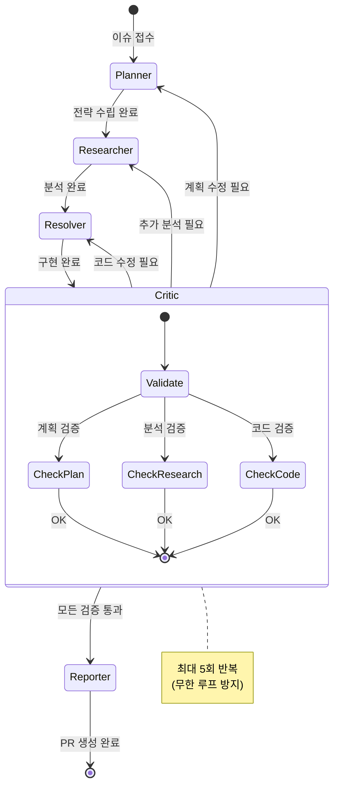

# issue-solve-multi-agent-system
OSS 이슈 해결을 위한 멀티 에이전트 시스템
해당 멀티 에이전트 repository는 아래의 시스템 구조도를 통해 이슈를 수집 및 해결 진행 예정입니다.
추후 https://github.com/riverfrot/advanced-rag-system repository를 MCP HTTP Streamable 서버로 구동 후 
tools로 사용 예정

## Architecture

### 전체 시스템 구조도

### RAG 시스템 통합 (모든 에이전트 공통 도구)

### 피드백 루프 상세

### 에이전트 역할

| 에이전트 | 역할 | 주요 기능 |
|---------|------|----------|
| **Planner** | 이슈 분석 및 해결 계획 수립 | 이슈 분류, 우선순위 설정, 해결 전략 수립 |
| **Researcher** | 코드베이스 분석 및 정보 수집 | RAG 시스템 활용, 관련 코드 탐색, 외부 리소스 조사 |
| **Critic** | Resolver가 해결한 이슈에 대해 한번 더평가 | 코드 리뷰, 테스트 계획, 잠재적 이슈 식별 |
| **Resolver** | 실제 해결책 구현 | 코드 수정, 패치 생성, 테스트 실행 |
| **Reporter** | 결과 보고 및 문서화 | 해결 보고서 작성, 변경사항 문서화 |

## Installation

### Prerequisites

- Python 3.8+
- Docker & Docker Compose
- Kubernetes cluster (선택사항)

### **TODO:**
- [ ] Planner 에이전트 구현
- [ ] Researcher 에이전트 구현
- [ ] FastMCP 서버 연동
- [ ] 기본 API 엔드포인트 구현
- [ ] 비동기 큐 시스템 구현
- [ ] Kubernetes 기반 자동 스케일링
- [ ] 웹 대시보드 개발
- [ ] 고급 모니터링 및 로깅
- [ ] 다중 Repository 동시 처리
- [ ] AI 모델 성능 최적화

## 라이선스

MIT License
